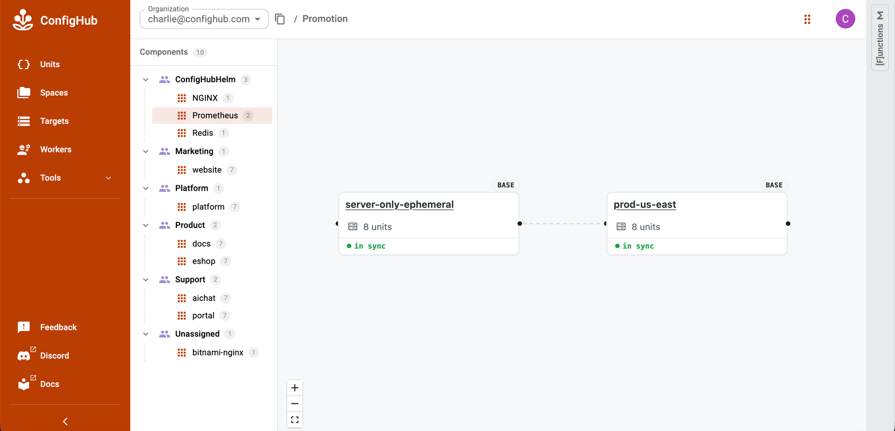

# Tutorial Sequence

**UNOFFICIAL/EXPERIMENTAL**

This is a detailed repository proof sequence. It is not the ConfigHub product
tutorial.

Use the
[official ConfigHub tutorial](https://docs.confighub.com/get-started/tutorial/)
for the normal product journey. Use this page when you need the project
commands and receipts behind the catalog examples.

Each section says what you are doing, what to inspect, and what the result
means:

```text
what the tutorial proves
-> explanatory flow
-> commands
-> what success looks like
```

For concrete output snippets and cluster choices, keep
[Expected Results And Clusters](./expected-results-and-clusters.md) open beside
this page. A tutorial should always give the user a local check, a UI check, or
a receipt to compare with their own output.

The first tutorials use Redis because it is small and familiar. The later
tutorials show promotion, custom overlays, the GitOps/runtime proof lane, and
bulk operations over uploaded ConfigHub Units.

## Run From The Repo Root

Start from a current checkout:

```sh
git clone https://github.com/confighub/helm-expt.git
cd helm-expt
git status --short --branch
```

If you already have a checkout, run from the repository root for the optional
`npm run ...` proof checks. The `cub installer setup --pull oci://...` commands
pull public installer packages and do not require a repo-local `packages/...`
path.

## Prerequisites

Install or verify the local tools before Tutorial 1:

```sh
cub version
cub plugin install confighub/installer
cub installer --help

go install sigs.k8s.io/kustomize/kustomize/v5@v5.8.1
export PATH="$HOME/go/bin:$PATH"

cub context get -o json
cub space list -o json
```

The installer plugin is released for macOS and Linux on AMD64 and ARM64.
`cub plugin install` downloads the matching binary. For a later release, run
`cub plugin upgrade installer`. An early source-built copy may need to be
uninstalled once before the released plugin can be installed.

`cub installer setup` shells out to `kustomize build`; the first setup fails if
`kustomize` is not on `PATH`. The tutorials do not require `helm`.

`cub context get -o json` proves a context is selected. `cub space list -o json`
is the useful auth check for the upload tutorials. If it fails with an
authentication problem, run:

```sh
cub auth login
```

Tutorials with live Kubernetes steps also need `kubectl` on `PATH` and a
reachable cluster context. Users can bring their own cluster. For a disposable
local kind cluster with Argo CD and ConfigHub OCI delivery, use
`cub cluster up`.

## Verification Names Used Here

This page uses three different verification layers. These are not all part of
the default product UX. Use the narrowest check that matches the thing you just
did.

| Name | Scope | Reruns Helm? | Touches a cluster? |
| --- | --- | --- | --- |
| `npm run verify` | Repository-wide committed artifact consistency: docs, command surfaces, recipes, packages, receipts, catalog data, and generated data. | No, not in the default path. | No, it verifies committed receipts. |
| `redis:compare` | Fresh Redis Helm-vs-`cub installer` comparison. | Yes. | No. |
| Most `<chart>:compare` commands | Curated chart package/setup verification against the stored Helm-rendered object set. | No; fresh Helm rendering happens in `:generate-proof`. | No. |
| `redis:verify-install:*` | A user's own Redis tutorial state after setup, upload, or apply. | No for `render`; it checks the user's rendered work dir against the Redis acceptance contract. | Only `redis:verify-install:cluster`; when available, cub-scout writes live object-set, workload, and prerequisite receipts. |

`redis:verify-install:*` currently ships because Redis is the first
outside-user quick-start with `recipes/bitnami/redis/25.5.3/install-checks.yaml`.
Other tutorials use chart-specific proof/package checks, generated goldens, or
live ConfigHub/GitOps checks until they get their own `install-checks.yaml`.

For a first user journey, skip the broad `npm run verify` command unless you are
reviewing the repository itself. The ordinary checks should be things like:

```text
cub installer setup completed
work directory has out/manifests
ConfigHub Space has Units
kubectl shows workloads
the specific receipt for this step says PASS, watch, or blocked with a reason
```

## Picking A Path

For a quick outside-eyes test, run Tutorial 1 and Tutorial 7 first. Tutorial 7 is
the most self-contained operating demo after the NGINX base is uploaded.

Tutorials 2 and 6 touch live Kubernetes. Tutorial 6 creates its temporary
cluster and ConfigHub OCI target with `cub cluster up`.

## Tutorial 1: Redis Quick Start

This proves the basic path from a public Helm chart to ConfigHub Units.

```text
Helm chart
-> cub installer recipe/package
-> choose the recommended redis/reuse-existing-secret base
-> cub installer setup renders Kubernetes YAML
-> cub installer upload creates ConfigHub Units
```

Run the render and upload path:

The first two commands are local. The upload and ConfigHub verification require
an authenticated `cub` CLI in the organization where you want the demo Space to
be created. If `helm-redis-existing-secret` already exists, choose a unique Space slug or
reuse the same work directory to reconcile the existing upload.

```sh
cub installer setup \
  --pull oci://europe-west1-docker.pkg.dev/nth-fort-499605-q5/helm-expt/bitnami-redis:25.5.3@sha256:7ad5fa6de0aa9c29df8cd26650893ebae6ad149a7c5ac33a8beedf5b02e2ac33 \
  --base reuse-existing-secret \
  --work-dir ./redis-reuse-existing-secret \
  --non-interactive \
  --namespace redis

npm run redis:verify-install:render -- \
  --base reuse-existing-secret \
  --work-dir ./redis-reuse-existing-secret \
  --namespace redis

cub installer upload \
  --work-dir ./redis-reuse-existing-secret \
  --space helm-redis-existing-secret \
  --component Redis \
  --layer App \
  --environment Demo \
  --owner ConfigHubHelm \
  --variant reuse-existing-secret \
  --unit-label Component=Redis \
  --unit-label HelmChart=bitnami-redis \
  --unit-label HelmChartVersion=25.5.3 \
  --unit-label Variant=reuse-existing-secret \
  --unit-label Proof=redis-confighub-proof

npm run redis:verify-install:confighub -- \
  --base reuse-existing-secret \
  --space helm-redis-existing-secret
```

What success looks like:

```text
Redis/reuse-existing-secret renders the same Kubernetes objects as regular Helm.
ConfigHub stores the rendered objects as labeled Units.
You can verify both the local render and the uploaded Units.
```

Check that ConfigHub has the Redis Units:

```sh
cub unit list --space helm-redis-existing-secret \
  --columns Unit.Slug,Unit.Labels.Component,Unit.Labels.Variant
```

Expect 14 Units: 13 Redis Kubernetes objects plus `installer-record`.

Where to look in the UI:

```text
ConfigHub -> Space helm-redis-existing-secret -> Units
```

Full script: [docs/demo/redis/demo-script.md](../demo/redis/demo-script.md).

You can see a UX proposal for this stage here:
[Redis Quick Start UX Proposal](./ux-proposal-redis-quick-start-tutorial.md).

For a standard Helm baseline, install the same chart into a separate namespace
or throwaway cluster, then compare at the parity layer rather than by eye. The
strict comparison path is documented in
[Expected Results And Clusters](./expected-results-and-clusters.md#stage-2-standard-helm-baseline).

## Tutorial 2: Redis Secret Modes

This proves why some choices are base variants, not post-render edits.

```text
redis/default (legacy static-password demonstration; not recommended)
  Helm renders Secret redis/redis with fixed demonstration material.
  cub installer separates the Secret to out/secrets for local use.
  cub installer upload does not upload the Secret as a ConfigHub Unit.

redis/reuse-existing-secret
  Helm renders no Redis Secret.
  Workloads reference redis/redis-existing-secret key redis-password.
  The existing Secret is a target fact and external requirement.
  This is the package's recommended default.
```

Run the existing-Secret path:

This tutorial is written for the catalog namespace `redis`. Redis embeds that
namespace in service DNS values, so changing the namespace changes rendered
object data. Treat a different namespace as a separate render choice and review
the diff deliberately.

```sh
kubectl --context <your-context> create namespace redis \
  --dry-run=client -o yaml | kubectl --context <your-context> apply -f -

kubectl --context <your-context> -n redis create secret generic redis-existing-secret \
  --from-literal=redis-password="$(openssl rand -base64 32)" \
  --dry-run=client -o yaml | kubectl --context <your-context> apply -f -

cub installer setup \
  --pull oci://europe-west1-docker.pkg.dev/nth-fort-499605-q5/helm-expt/bitnami-redis:25.5.3@sha256:7ad5fa6de0aa9c29df8cd26650893ebae6ad149a7c5ac33a8beedf5b02e2ac33 \
  --base reuse-existing-secret \
  --work-dir ./redis-reuse-existing-secret \
  --non-interactive \
  --namespace redis

npm run redis:verify-install:render -- \
  --base reuse-existing-secret \
  --work-dir ./redis-reuse-existing-secret \
  --namespace redis
```

Optional local live check:

```sh
kubectl --context <your-context> apply -f ./redis-reuse-existing-secret/out/manifests

npm run redis:verify-install:cluster -- \
  --base reuse-existing-secret \
  --context <your-context> \
  --namespace redis
```

What this proves:

```text
The static-password demonstration and reuse-existing-secret are different base
variants because Helm renders different Kubernetes objects and references.
The existing-Secret preset is the normal starting point.
```

If you ran the live step, the `redis:verify-install:cluster` command above
should pass with StatefulSet, PVC, Redis PING, and target Secret checks.

You can see a UX proposal for this stage here:
[Redis Secret Modes UX Proposal](./ux-proposal-redis-secret-modes-tutorial.md).

## Tutorial 3: Prometheus Base Variant

This proves how a values choice becomes a reviewed base variant when it changes
the rendered object set.

```text
prometheus/default
-> full chart shape

prometheus/server-only-ephemeral
-> disables bundled components and persistence
-> renders fewer Kubernetes objects
-> gets its own package base, revision, receipts, scans, and gate
```

Run the server-only base:

```sh
cub installer setup \
  --pull oci://europe-west1-docker.pkg.dev/nth-fort-499605-q5/helm-expt/prometheus-community-prometheus:29.8.0@sha256:5cf6400c75d1cafc06fee5ddaada47651926bdab3a9d674a9f966540b29edd26 \
  --base server-only-ephemeral \
  --work-dir .tmp/demo/prometheus-server-only \
  --non-interactive \
  --namespace monitoring
```

Inspect the catalog proof:

```sh
npm run prometheus:verify-proof
npm run prometheus:verify-package
```

What this proves:

```text
server-only-ephemeral is not a ConfigHub-only tweak.
It changes the rendered YAML, so it belongs in the cub installer base path.
```

Catalog page:
[recipes/prometheus-community/prometheus/29.8.0/CATALOG.md](../../recipes/prometheus-community/prometheus/29.8.0/CATALOG.md).

You can see a UX proposal for this stage here:
[Prometheus Base Variant UX Proposal](./ux-proposal-prometheus-base-variant-tutorial.md).

For the larger Prometheus Operator chart, see
[Prometheus High-Fanout Example](./prometheus-high-fanout.md). It shows how
`kube-prometheus-stack/default` and `kube-prometheus-stack/no-crds` differ by 10
CRD objects and why the `no-crds` base needs target prerequisites.

## Tutorial 4: Prometheus Promotion Variant

This shows the proposed product flow for creating a derived ConfigHub variant
after the reviewed base has been uploaded.

```text
Prometheus/server-only-ephemeral
-> uploaded reviewed ConfigHub Space
-> cub variant create clones that Space and its Units
-> Prometheus/prod-us-east adds target, environment, region, gates, and links
-> no Helm rerender
```

Current CLI primitive:

The command details are summarized in
[cub Variant Command Surface](./cub-variant-command-surface.md). The key point
is that `cub variant create` clones a reviewed upstream Space and its Units; it
does not run Helm again.

First upload the reviewed base Space if it does not already exist:

```sh
cub installer upload \
  --work-dir .tmp/demo/prometheus-server-only \
  --space helm-prometheus-server-only \
  --component Prometheus \
  --layer App \
  --environment Demo \
  --owner ConfigHubHelm \
  --variant server-only-ephemeral \
  --unit-label Component=Prometheus \
  --unit-label HelmChart=prometheus-community-prometheus \
  --unit-label HelmChartVersion=29.8.0 \
  --unit-label Variant=server-only-ephemeral
```

Then clone the Space into a derived ConfigHub variant:

```sh
cub variant create prod-us-east helm-prometheus-server-only \
  --environment Prod \
  --region us-east \
  --space-pattern 'template:{{.Labels.Component}}-{{.Labels.Variant}}' \
  --unit-delete-gate production-review \
  --unit-destroy-gate production-review
```

Add `--target <target-slug>` only when the target already exists. The command
sets the downstream Space labels such as `Variant=prod-us-east`,
`Environment=Prod`, and `Region=us-east`. Cloned Units keep the source base
labels unless a post-clone trigger or later bulk update changes them.

When the reviewed upstream base changes later, preview the downstream update
before writing it:

```sh
cub variant promote prod-us-east --dry-run
```

Then promote through a changeset and the same approval/delivery path used for
other ConfigHub operations.

A future/polished [Creator flow](../reference/variant-creation-artifact.md#creator-status)
should present this as:

```text
Create variant
From: Prometheus/server-only-ephemeral
For: prod-us-east
Change: target, environment, region, production gates, observation policy
Review: same Prometheus install shape
Status: ready to create
Create
```

What success looks like:

```text
Promotion uses ConfigHub clone/link/label/target primitives.
It does not create a new Helm render unless the requested change alters the
Kubernetes object set.
```

Check the derived Space and cloned Units:

```sh
cub space get Prometheus-prod-us-east
cub unit list --space Prometheus-prod-us-east \
  --columns Unit.Slug,Unit.Labels.Variant,Unit.DeleteGates,Unit.DestroyGates
```

Expect 8 cloned Units. The Space carries `Variant=prod-us-east`; Units keep the
source base label unless a post-clone operation changes them.

Where to look in the UI:

Open the [ConfigHub Promotion view for Prometheus](https://auth.confighub.com/x/promotion?app=Prometheus)
to see `server-only-ephemeral` and `prod-us-east` side by side, both showing 8 units in sync.

Worked example:
[Prometheus Promotion Example](./prometheus-overlay-promotion-example.md).

You can see a UX proposal for this stage here:
[Prometheus Promotion UX Proposal](./ux-proposal-prometheus-promotion-tutorial.md).

## Tutorial 5: ExternalDNS Custom Overlay

This shows how a managed or customer overlay is routed.

```text
wrapper chart + platform values + customer overlay values
-> classify each value before render
-> render-time values go through cub installer
-> post-render operating choices go through derived ConfigHub variants
```

This tutorial is also where the product support split shows up:

```text
free/out-of-box catalog config
  ExternalDNS managed AWS base shape, when it is common enough to support.

ConfigHub customization
  Acme prod target, environment, region, gates, facts, and observation policy
  as a derived variant over the reviewed base.

managed or potentially paid complexity
  private wrapper charts, private customer values, GitOps import, fleet
  creation, full stacks, production receipts, and support SLAs.
```

Example base:

```text
ExternalDNS/managed-aws-acme
```

Installer/base values that change rendered Kubernetes YAML:

```yaml
provider: aws
sources:
  - service
  - ingress
registry: txt
domainFilters:
  - acme.example.com
txtOwnerId: acme-prod-us-east
serviceAccount:
  annotations:
    eks.amazonaws.com/role-arn: arn:aws:iam::123456789012:role/external-dns-acme-prod
rbac:
  create: true
```

Derived customer variant:

```text
ExternalDNS/managed-aws-acme
-> ExternalDNS/customer-acme-prod
```

Post-render operating choices:

```yaml
customer: acme
environment: prod
region: us-east
target: prod-us-east
observationFreshness: PT15M
targetFacts:
  requiredHostedZones:
    - acme.example.com
  requiredSecrets:
    - external-dns/external-dns-aws
```

Verify the managed-overlay golden:

```sh
npm run variant-goldens:verify
```

What this proves:

```text
Customer values that affect Kubernetes YAML become a reviewed installer base.
Customer operating context becomes a derived ConfigHub variant.
Secret material stays outside the public proof.
The golden is a classification test fixture, not a live import or production
readiness receipt.
```

Plain example:
[Custom Overlays](./custom-overlays.md).

Golden data:
[data/managed-overlay-goldens/external-dns-customer-acme-prod/README.md](../../data/managed-overlay-goldens/external-dns-customer-acme-prod/README.md).

You can see a UX proposal for this stage here:
[ExternalDNS Custom Overlay UX Proposal](./ux-proposal-externaldns-custom-overlay-tutorial.md).

## Before Live GitOps Runs: Bring Kubernetes And Argo CD

The live GitOps tutorial needs a Kubernetes cluster with Argo CD installed and
able to pull from the ConfigHub OCI gateway.

Recommended local setup:

```sh
cub cluster up \
  --name helm-expt-oci-demo \
  --space helm-expt-oci-demo-cluster
```

`cub cluster up` creates a disposable kind cluster, installs Argo CD, and
writes a dedicated kubeconfig at:

```text
$HOME/.confighub/clusters/helm-expt-oci-demo.kubeconfig
```

It also creates the ConfigHub pieces used by the tutorial:

```text
helm-expt-oci-demo-cluster        cluster/root Space
helm-expt-oci-demo-cluster/oci    OCI target
root Application Unit             watches the cluster Space release
```

If you bring your own cluster instead, set up the same contract:

```text
Kubernetes cluster is reachable with kubectl.
Argo CD is installed in the cluster.
Argo can reach oci.hub.confighub.com:443.
Argo has any pull secret/token required for the ConfigHub OCI gateway.
ConfigHub has a cluster Space with an OCI target.
The workload Space uses that target as its release target.
cub release publish <workload-space> creates the reviewed Space release OCI.
An Argo Application points at /space/<workload-space>, targetRevision latest,
and path ".".
```

For this tutorial, the Argo Application source looks like:

```yaml
repoURL: oci://oci.hub.confighub.com:443/space/<workload-space>
targetRevision: latest
path: .
```

When Units change, publish a new Space release. Argo reconciles that immutable
revision and applies the reviewed objects without rendering the source package
again.

Check that the root Application exists:

```sh
KUBECONFIG="$HOME/.confighub/clusters/helm-expt-oci-demo.kubeconfig" \
kubectl --context kind-helm-expt-oci-demo get application \
  helm-expt-oci-demo-cluster -n argocd
```

## Tutorial 6: GitOps And Runtime Proof

This repository has one exact catalog-base test for the current delivery
boundary. It starts from the `bitnami/nginx@24.0.2` `http-clusterip` preset,
checks that `cub installer` reproduces the committed objects, uploads them as
ConfigHub Units, and publishes one Space release OCI.

```text
public installer-package OCI
-> cub installer selects the NGINX preset
-> exact objects become ConfigHub Units
-> cub release publish creates one Space release OCI
-> Argo CD, Flux, and direct apply consume the same digest
-> each path must reach a ready NGINX Deployment and ClusterIP Service
```

Run it only in an authenticated scratch organization. The guard refuses to use
the maintained `helm-catalog` context:

```sh
CUB_CONTEXT=scratch-context \
HELM_EXPT_ALLOW_SCRATCH_ORG=1 \
npm run catalog-oci:proof
```

The test creates and removes its own cluster and temporary Spaces. Success is:

```text
rendered objects: exact match
ConfigHub release: published
Argo CD: pass
Flux: pass
direct apply: pass
release digest: identical for all three
NGINX: ready under all three
cleanup: pass
```

Verify the committed receipt without creating a cluster:

```sh
npm run catalog-oci:proof:verify
```

Read the [plain-English result](../../data/catalog-oci-delivery-proof/summary.md)
and the
[typed receipt](../../runs/catalog-oci-delivery-proof/bitnami-nginx-24-0-2-http-clusterip.yaml).
This proves one exact NGINX preset on the recorded target. It is not a claim
about every catalog entry.

## Tutorial 7: Bulk Scan And Bulk Patch

This shows the operating value once Helm output has become ConfigHub Units.

```text
uploaded ConfigHub Units
-> bulk scan the selected Units
-> create a changeset
-> bulk patch metadata, gates, or approved fields
-> re-scan
-> bulk approve the reviewed revision
```

Use NGINX as the small example:

```text
Component: NGINX
Base variant: http-clusterip
Space: helm-nginx-http-clusterip
```

Upload or select the reviewed base first:

```sh
cub installer setup \
  --pull oci://europe-west1-docker.pkg.dev/nth-fort-499605-q5/helm-expt/bitnami-nginx:24.0.2@sha256:08947210de607a6b9b8e7b8423b024e3fe89a0fc2b09581f80e2401008e445a1 \
  --base http-clusterip \
  --work-dir .tmp/demo/nginx-http \
  --non-interactive \
  --namespace nginx

cub installer upload \
  --work-dir .tmp/demo/nginx-http \
  --space helm-nginx-http-clusterip \
  --component NGINX \
  --layer App \
  --environment Demo \
  --owner ConfigHubHelm \
  --variant http-clusterip \
  --unit-label Component=NGINX \
  --unit-label HelmChart=bitnami-nginx \
  --unit-label HelmChartVersion=24.0.2 \
  --unit-label Variant=http-clusterip
```

Check that the upload created NGINX Units:

```sh
cub unit list --space helm-nginx-http-clusterip \
  --columns Unit.Slug,Unit.Labels.Component,Unit.Labels.Variant
```

Expect 7 Units: 6 NGINX Kubernetes objects plus `installer-record`.

Bulk scan the uploaded Units:

```sh
cub function vet vet-format \
  --space helm-nginx-http-clusterip \
  --where "Labels.Component = 'NGINX' AND Labels.Variant = 'http-clusterip'" \
  --output wide
```

Expect `Passed: true` for the 6 selected NGINX Units.

Create a changeset for the patch:

```sh
cub changeset create \
  --space helm-nginx-http-clusterip \
  nginx-bulk-hardening \
  --description "Bulk hardening patch after scan"
```

Check that the changeset exists:

```sh
cub changeset get --space helm-nginx-http-clusterip nginx-bulk-hardening
```

Expect the changeset to exist in `helm-nginx-http-clusterip`.

Bulk patch metadata and gates for every matching Unit:

```sh
cub unit update --patch \
  --space helm-nginx-http-clusterip \
  --where "Labels.Component = 'NGINX' AND Labels.Variant = 'http-clusterip'" \
  --changeset nginx-bulk-hardening \
  --change-desc "Mark NGINX Units as scanned and production-review gated" \
  --label ScanDisposition=reviewed \
  --label Operation=bulk-scan-patch \
  --delete-gate production-review \
  --destroy-gate production-review
```

Check that the metadata and gates landed:

```sh
cub unit list --space helm-nginx-http-clusterip \
  --where "Labels.Component = 'NGINX' AND Labels.Variant = 'http-clusterip'" \
  --columns Unit.Slug,Unit.Labels.ScanDisposition,Unit.DeleteGates,Unit.DestroyGates
```

Expect 6 Units with `ScanDisposition=reviewed` and `production-review` gates.

If there is an approved mutating function for the field you want to change, use
`cub function set` instead of ad hoc file editing. Always dry-run first:

```sh
cub function set --dry-run \
  --space helm-nginx-http-clusterip \
  --where "Labels.Component = 'NGINX' AND Labels.Variant = 'http-clusterip'" \
  --changeset nginx-bulk-hardening \
  --output mutations \
  set-image nginx nginx:1.25.5
```

Expect one changed path on `deployment-nginx-nginx`:
`spec.template.spec.containers.?name=nginx.image`.

Apply the same function after reviewing the mutation output:

```sh
cub function set \
  --space helm-nginx-http-clusterip \
  --where "Labels.Component = 'NGINX' AND Labels.Variant = 'http-clusterip'" \
  --changeset nginx-bulk-hardening \
  --change-desc "Set reviewed NGINX image" \
  set-image nginx nginx:1.25.5
```

Check the changed image field:

```sh
cub unit data deployment-nginx-nginx --space helm-nginx-http-clusterip
```

Expect the main `nginx` container image to be `nginx:1.25.5`.

Re-scan the changed Units:

```sh
cub function vet vet-format \
  --space helm-nginx-http-clusterip \
  --where "Labels.Component = 'NGINX' AND Labels.Variant = 'http-clusterip'" \
  --changeset nginx-bulk-hardening \
  --output wide
```

Expect `Passed: true` for the 6 selected NGINX Units.

Bulk approve the reviewed current revisions:

```sh
cub unit approve \
  --space helm-nginx-http-clusterip \
  --where "Labels.Component = 'NGINX' AND Labels.Variant = 'http-clusterip'"
```

Verify the whole bulk-ops result:

```sh
npm run verify-bulk-ops:nginx -- \
  --space helm-nginx-http-clusterip \
  --changeset nginx-bulk-hardening
```

What success looks like:

```text
PASS verify-bulk-ops:nginx helm-nginx-http-clusterip
units: 6
approved units: 6
deployment image: nginx:1.25.5
vet-format passes: 6
```

Where to look in the UI:

```text
ConfigHub -> Space helm-nginx-http-clusterip -> Units
ConfigHub -> Space helm-nginx-http-clusterip -> Changesets -> nginx-bulk-hardening
ConfigHub -> Unit deployment-nginx-nginx -> Data / Revisions
```

What this proves:

```text
The scan targets a labeled set of rendered Units.
The patch is tied to a changeset.
Metadata and gates can be patched in bulk with cub unit update --patch.
Data changes use approved mutating functions such as cub function set.
Approval is also bulk and selector-based.
```

This is the bulk-ops story we want to demonstrate:

```text
Helm gives you a rendered release.
ConfigHub gives you a searchable object set you can scan, patch, review,
approve, and audit as a group.
```

You can see a UX proposal for this stage here:
[Bulk Scan And Bulk Patch UX Proposal](./ux-proposal-bulk-scan-patch-tutorial.md).

## See what you built

After completing the tutorials, browse the configurations you created in the ConfigHub UI:

- [Promotion view — Prometheus](https://auth.confighub.com/x/promotion?app=Prometheus) — shows
  `server-only-ephemeral` and `prod-us-east` side by side with their cloned units and sync status
  (produced by Tutorials 3 and 4).
- Use the left-hand component tree to navigate to Redis, NGINX, and other components you uploaded.


