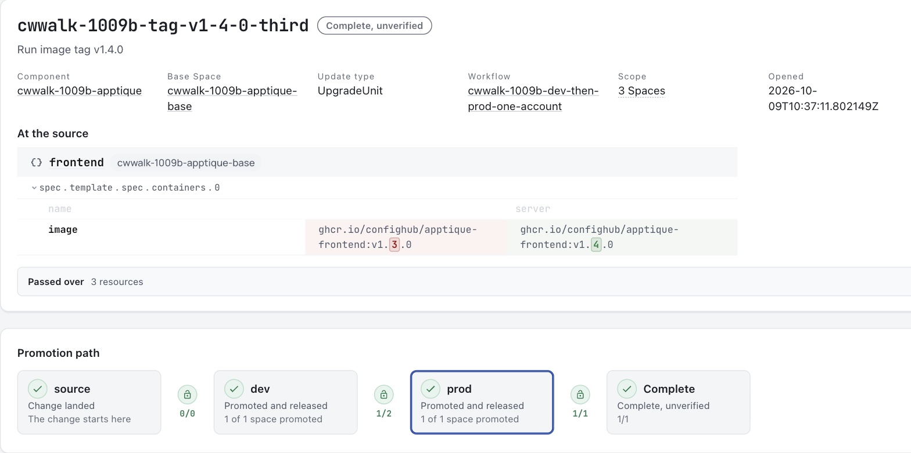
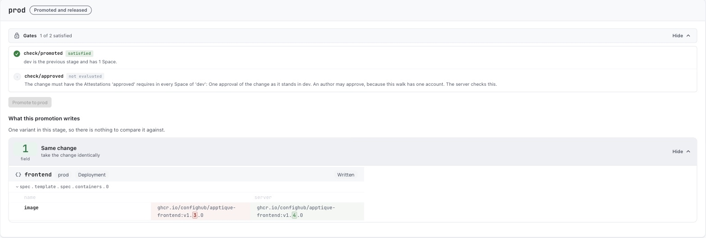

# Review one change before it ships

**UNOFFICIAL/EXPERIMENTAL**

A change reviewer asks four things. Which objects change, and in which
environment? Who approved the change? What was released? What can a person
check afterwards?

This Guide answers all four for one small app with a dev and a prod
environment and one change, an image tag. Every command below was run on
9 October 2026, and the [log of that run](./live-walk-change-review-2026-10-09.md)
holds each command with the output it printed.

## What each part needs

| Part | What you do | What it needs |
| --- | --- | --- |
| 1 | List the objects the change affects in each environment | `cub`, the Workshop plugin, `kustomize` and `git`. No account and no cluster. |
| 2 | Put the app in ConfigHub, set a gate, propose the change, preview it and approve it | A ConfigHub account. No cluster. |
| 3 | Release the approved change and read the result | The account, plus Docker and `kind` for a throwaway local cluster. |

Part 1 answers the first question on its own. Stop there if that is all you
need.

## The answers from the recorded run

- **Which objects change, and where.** One object changes, in one environment. It is the Deployment `apptique-prod/frontend`, and the field is the image of the container `server`, from `v1.3.0` to `v1.4.0`. The other three objects in prod and all four objects in dev do not change.
- **Who approved.** ConfigHub holds an approval record made in the dev environment against the change. The record carries the result, the time, a note in the approver's words and the approver's user id.
- **What was released.** Release 2 of the prod environment carries the change, and Release 1 holds prod as it stood before. Each Release has a digest.
- **What a person checks afterwards.** The change record lists who promoted the change into dev and into prod, when, and which Release carries it. The diff between the two Releases shows the one field.

The run had limits, and [the last section](#what-this-run-does-not-show) lists
them. Read it before you rely on this page. The two that matter most are that
one account both wrote and approved the change, and that the app's pods never
started.

## Part 1. List what the change affects

This part needs no account and no cluster.

Install [the cub CLI](https://confighub.github.io/helm-expt/site/try.html#install-cub)
and [kustomize](https://kubectl.docs.kubernetes.io/installation/kustomize/).
Then install the Workshop plugin release this part was checked with
(version 0.6.58).

```sh
cub plugin install confighub/cub-workshop@v0.6.58
```

Fetch the example. It is a small public repository layout with a `base`, a
`dev` overlay and a `prod` overlay.

```sh
git clone -q https://github.com/confighub/examples
git -C examples checkout -q 7f1b8f2f
cd examples/gitops/argo/intermediate-ci-to-gitops
```

Make the change in a copy, so that the original stays as the repository has
it. The change is one line. Prod moves from image tag `v1.3.0` to `v1.4.0`,
which dev already runs.

```sh
cp -R gitops-repo gitops-repo-change
sed -i "" "s/newTag: v1.3.0/newTag: v1.4.0/" gitops-repo-change/environments/apptique/prod/kustomization.yaml
```

The `sed -i ""` form is for macOS. On Linux, write `sed -i` with no empty
string after it.

Render each environment before and after the change, and compare each pair.

```sh
for env in dev prod; do
  kustomize build gitops-repo/environments/apptique/$env > before-$env.yaml
  kustomize build gitops-repo-change/environments/apptique/$env > after-$env.yaml
  echo "== $env"
  cub config diff before-$env.yaml after-$env.yaml
done
```

This is the output.

```text
== dev
Configuration diff: 0 added, 0 removed, 0 changed, 4 unchanged
Local comparison only. This does not merge, protect edits or inspect a live target.
== prod
Configuration diff: 0 added, 0 removed, 1 changed, 3 unchanged
  changed: apps/v1 Deployment apptique-prod/frontend
    /spec/template/spec/containers/server/image replace: "ghcr.io/confighub/apptique-frontend:v1.3.0" -> "ghcr.io/confighub/apptique-frontend:v1.4.0"
Local comparison only. This does not merge, protect edits or inspect a live target.
```

Dev is untouched. Prod has one changed object and one changed field. That is
the exact list of affected objects for each environment.

Add `--json --out change.json` to keep the result as a file for a review
record. Add `--exit-code` to make the command exit 1 when the two files
differ, which suits a pipeline.

This comparison reads two files. It does not read a cluster, and it does not
say the change is safe.

## Part 2. Propose the change in ConfigHub and have it approved

This part needs a ConfigHub account. It uses no cluster. Sign in with
`cub auth login` first.

The commands below use three names of your choosing.

```sh
APP=apptique-review
WORKFLOW=dev-then-prod
CHANGE=tag-v1-4-0
```

The recorded run used longer names with a prefix for its session. The commands
are otherwise the ones in the log.

### Put the app in as a base with a dev and a prod variant

ConfigHub holds the app as one base and two variants of it. A change is made
once in the base. It reaches dev first and prod second, and the server keeps
that order.

```sh
kustomize build gitops-repo/environments/apptique/base > base.yaml
cub variant upload --component $APP --variant base --namespace apptique --create-namespace --change-desc "Seed the base from the repository base directory" base.yaml
cub function set --space $APP-base --unit frontend --change-desc "Run image tag v1.3.0" set-container-image-reference server :v1.3.0
cub function set --space $APP-base --unit namespace --change-desc "Label the namespace as the repository overlays do" set-label app.kubernetes.io/part-of apptique-examples
cub variant create dev $APP-base --stage dev --environment Dev --namespace apptique-dev --change-desc "Clone the base as dev"
cub variant create prod $APP-base --stage prod --environment Prod --namespace apptique-prod --change-desc "Clone the base as prod"
cub function set --space $APP-dev --change-desc "Label every object environment dev, as the dev overlay does" set-label environment dev
cub function set --space $APP-prod --change-desc "Label every object environment prod, as the prod overlay does" set-label environment prod
cub function set --space $APP-prod --unit frontend --change-desc "Run three replicas in prod, as the prod overlay does" set-replicas 3
cub function set --space $APP-prod --unit frontend --change-desc "Give prod the requests and limits of the prod overlay" set-container-resources server all 200m 128Mi 2
```

The last four commands give each variant what its overlay gives it in the
repository. The run then compared what ConfigHub held for prod with the
repository's render of prod, and `cub config diff` reported no difference.

This model differs from the repository in one way. The repository keeps the
image tag in each overlay. Here the tag lives in the base, and the change to
prod is a promotion. The run tied the two together by comparing ConfigHub's
copy with the repository's render before and after the change.

### Set a gate that asks for an approval before prod

A gate takes two commands. The first makes a workflow with a dev stage and a
prod stage, where entry into prod needs one approval. The second tells the
Component that every change must go through that workflow.

```sh
cub changeworkflow create --space $APP-base $WORKFLOW --stage dev --stage prod --attestation-prerequisite approved --attestation-prerequisite-count approved=1 --attestation-prerequisite-allow-authors approved=true --attestation-prerequisite-description approved="One approval of the change as it stands in dev" --stage-prerequisites prod=approved
cub component update --patch $APP --allowed-change-workflow $APP-base/$WORKFLOW --change-workflow-required
```

Leave out `--attestation-prerequisite-allow-authors approved=true` when a
second person will approve. Without that flag the server requires an approver
who did not write the change. The run had one account, so it needed the flag.
The run first tried without it. The server recorded the author's approval and
did not count it, and it went on refusing the promotion with these words.

```text
requires approved: 1 Approval attestation(s) from eligible attesters who did not write the change
```

The run did not see the default rule accept a second person, because it had no
second person.

### Propose the change and take it into dev

Make the change in the base, open a change order for it, and promote the
change order. The first promotion takes it into dev.

```sh
cub function set --space $APP-base --unit frontend --change-desc "Run image tag v1.4.0" set-container-image-reference server :v1.4.0
cub changeorder create --space $APP-base $CHANGE --description "Run image tag v1.4.0" --component $APP --change-workflow $APP-base/$WORKFLOW
cub variant promote --change-order $APP-base/$CHANGE --change-desc "Take the change order into dev"
```

### See that prod refuses the change before the approval

```sh
cub variant promote --change-order $APP-base/$CHANGE --target-stage prod --dry-run
```

The server refused it in the run, and it refused the real command in the same
words.

```text
Failed: unable to promote to stage 'prod', Variant 'dev': requires approved: 1 Approval attestation(s) from eligible attesters; frontend-service revision 4 has 0 of 1; frontend revision 9 has 0 of 1; namespace revision 4 has 0 of 1; frontend-serviceaccount revision 4 has 0 of 1
```

A promotion with no change order is refused too.

```text
Failed: HTTP 400 for req <request-id>: component cwwalk-1009b-apptique requires a ChangeWorkflow; use a ChangeOrder that has one
```

### Preview what the approver is approving

The gate refuses the promotion preview until the approval exists. The approver
reads the change with a diff instead.

```sh
cub variant diff $APP-dev Before:ChangeOrder:$APP-base/$CHANGE ChangeOrder:$APP-base/$CHANGE -o mutations
```

The run printed the one field.

```text
=== cwwalk-1009b-apptique-dev/frontend/8 -> cwwalk-1009b-apptique-dev/frontend/9
Resource: apps/v1/Deployment apptique-dev/frontend
  ~ [Update] spec.template.spec.containers.?name=server.image
      ghcr.io/confighub/apptique-frontend:v1.3.0 → ghcr.io/confighub/apptique-frontend:v1.4.0
1 of 4 unit(s) changed between Before:ChangeOrder:cwwalk-1009b-apptique-base/cwwalk-1009b-tag-v1-4-0-third and ChangeOrder:cwwalk-1009b-apptique-base/cwwalk-1009b-tag-v1-4-0-third in cwwalk-1009b-apptique-dev (3 unchanged, 0 at neither)
```

### Approve

```sh
cub variant approve --change-order $APP-base/$CHANGE --stage dev --note "Reviewed the change as it stands in dev. One field changes, the frontend image tag, from v1.3.0 to v1.4.0."
```

The run printed this.

```text
Recorded pass Approval attestation b158b021-2bea-494e-b888-fe194eced1f8 in cwwalk-1009b-apptique-dev, covering 4 revision(s)
```

Read the record with `cub attestation get`, giving the dev Space and the id
that the approval printed.

```text
ID                 b158b021-2bea-494e-b888-fe194eced1f8
Type               Approval
Result             Pass
Change Order ID    2627e22b-094d-4a93-89c8-888537bdac13
Note               Reviewed the change as it stands in dev. One field changes, the frontend image tag, from v1.3.0 to v1.4.0.
User ID            <user-id>
Created At         2026-10-09 10:37:42.055124 +0000 UTC
Space              cwwalk-1009b-apptique-dev
```

The record names the approver by user id. `cub user get <user-id>` gives the
account behind the id.

### Take the approved change into prod

```sh
cub variant promote --change-order $APP-base/$CHANGE --target-stage prod --change-desc "Take the change order into prod"
```

After the approval the same command went through. The run then compared prod
in ConfigHub with the repository's render of the one-line change, and
`cub config diff` reported no difference.

### See the same record in the ConfigHub web interface

This is the change order's page after the run. It shows the one changed field
at the source and the path the change took, from the base through dev to prod.



This is the prod stage of the same page. It shows the two gates on entry to
prod and the one field the promotion wrote.



The picture was taken after the release. At that point the page marks the
approval gate "not evaluated" and still prints its rule. The page also lists
who promoted and who published, with times. The pictures here leave that list
out because it names an account.

## Part 3. Release the change and read the result

This part needs the account, Docker and `kind`. The run brought up a throwaway
local cluster with `cub cluster up` and delivered each environment's Release
to it through Argo CD.

The run needed workarounds to connect variants that already existed to a new
cluster, and to give prod its first Release under the gate. Step 6 of
[the log](./live-walk-change-review-2026-10-09.md) has every command. This
Guide does not print them as a path to copy, because that path is not yet
short.

Publishing the approved change is one command.

```sh
cub release publish --revision ChangeOrder:$APP-base/$CHANGE $APP-prod
```

The run then listed prod's Releases.

```text
NUM    TAG                                                                PUBLISHED    DIGEST          LIVE    CREATED
2      cwwalk-1009b-apptique-base/cwwalk-1009b-tag-v1-4-0-third-co-end    true         0005a406ddc9            2026-10-09 10:45:47
1      release-1                                                          true         c587031ffa93            2026-10-09 10:42:32
```

About two minutes later the cluster carried the change. Argo CD reported the
Release's digest as its synced revision, and the Deployment's image read
`v1.4.0` with three replicas. These two lines come from two of the run's
checks.

```text
Synced Progressing revision=sha256:0005a406ddc969abd94886ffb1d529d85b3ba980fcfa7ed62d81e9739664b79d
ghcr.io/confighub/apptique-frontend:v1.4.0  replicas=3
```

The pods did not start. The example's image cannot be pulled without
credentials, so every pod stayed in `ImagePullBackOff`. The run shows that the
approved configuration reached the cluster. It does not show the app running.

## Check the change afterwards

These commands read the record after the fact.

```sh
cub changeorder get --space $APP-base $CHANGE
cub release list --space $APP-prod
cub revision list --space $APP-prod frontend
cub variant diff $APP-prod release-1 $APP-base/$CHANGE-co-end -o mutations
```

The change order joins the pieces. In the run it ended with these lines.

```text
State                    Released
Stage                    Completed
Last Promotion           2026-10-09T10:45:40Z, stage prod (2 recorded; -o json lists them all)
Released Spaces          cwwalk-1009b-apptique-dev (release 1), cwwalk-1009b-apptique-prod (release 2)
```

With `-o json` the change order lists each promotion with its stage, its time
and the user id of the person who ran it. The diff between the two Releases
prints the one field again, read from what was released.

## What this run does not show

- **One account wrote the change and approved it.** The gate allowed that only because the workflow was told to. No second person approved anything.
- **The app never ran.** Its image cannot be pulled without credentials. "Released" in ConfigHub meant published, and the cluster ran without the agent that reports live status back.
- **An approval covers content, and it outlives its change order.** An earlier approval of the same content satisfied the gate of a later change order. The run had to revoke the earlier approval to see the gate refuse.
- **A refused promotion leaves no record.** The change order shows who promoted and when. It does not show who tried and was refused.
- **Prod's first Release needed the requirement switched off for one command.** A Component that requires a workflow could not publish prod as it stood before the change.
- **The approval is recorded on dev's revisions.** Nobody approved prod's own revisions. The workflow has a separate setting for that, and the run did not use it.
- **No rollback of a released change was run.**
- **Permissions were not explored.** The run's account manages every object, so the run says nothing about who may approve, promote or publish.
- **No pull request was opened.** The one-line change exists only in a scratch copy of the repository.

The log's section on [what went wrong](./live-walk-change-review-2026-10-09.md#what-went-wrong)
has seventeen findings in all, including a mistake the run made and undid.

## A task for an assistant

Give an assistant this task to run Part 1 for you. It needs no account.

```text
Follow Part 1 of the ConfigHub Workshop Guide "Review one change before it ships".
Clone github.com/confighub/examples at commit 7f1b8f2f and work in
gitops/argo/intermediate-ci-to-gitops. Copy gitops-repo, change the prod image
tag from v1.3.0 to v1.4.0 in the copy, render dev and prod before and after
with kustomize, and compare each pair with cub config diff. Report, for each
environment, every object that changes and every field in it. Do not sign in,
do not use a cluster, and do not say the change is safe.
```

## Where to go next

- [Can I promote this configuration?](https://confighub.github.io/helm-expt/site/promote.html) compares any two files and helps you choose the tests a change needs.
- [See what a gpu-operator upgrade changes](./workshop-gpu-operator-upgrade-guide.md) moves a chart version through dev and QA.
- [What we refuse to claim](./what-we-refuse-to-claim.md) lists the limits that apply to every page.
